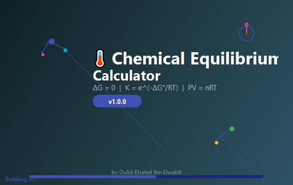
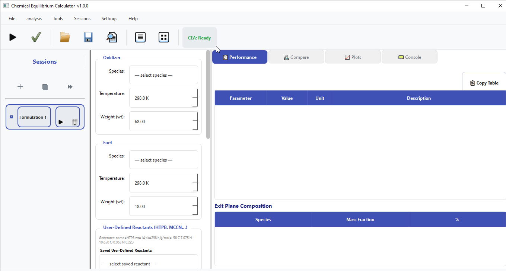
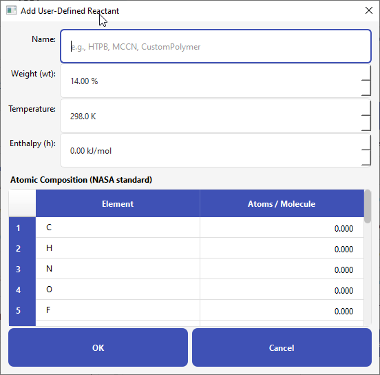
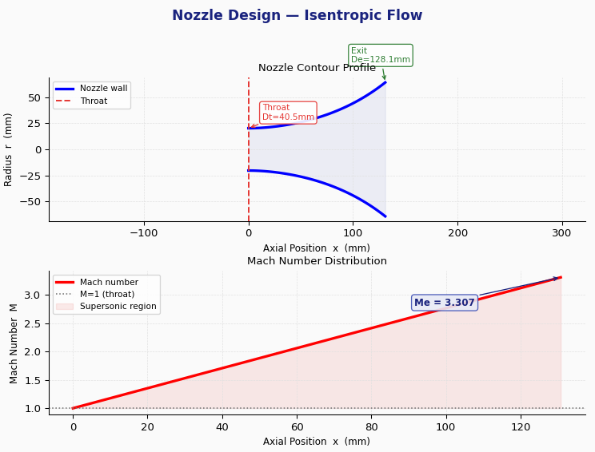
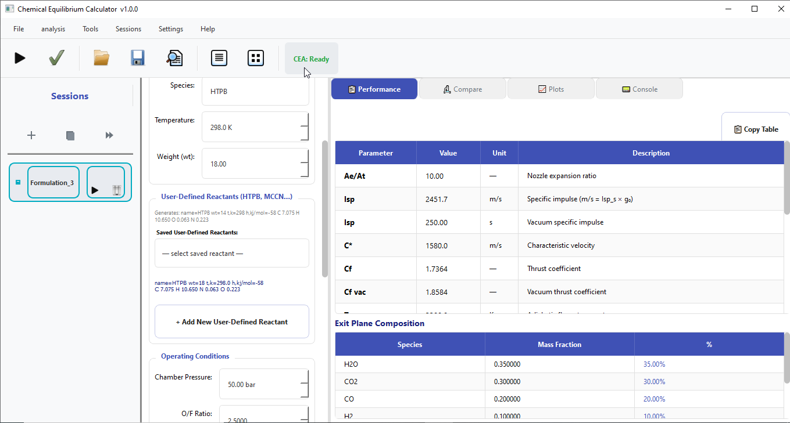
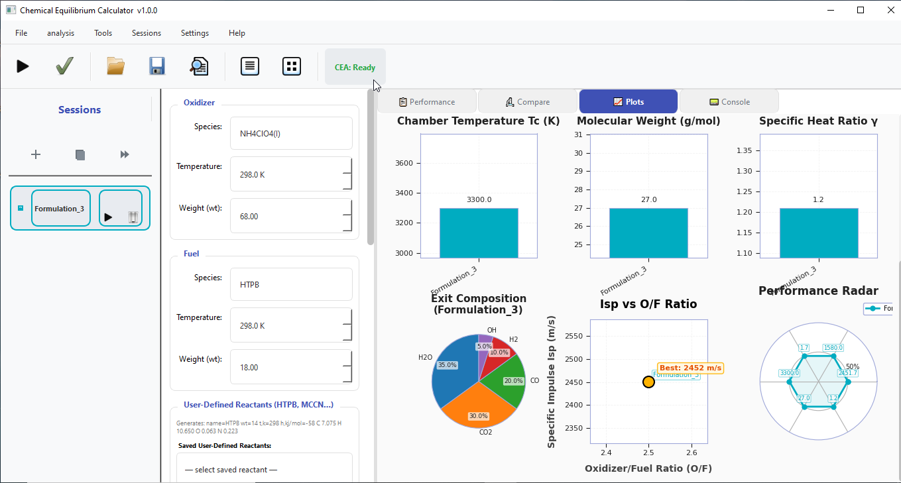
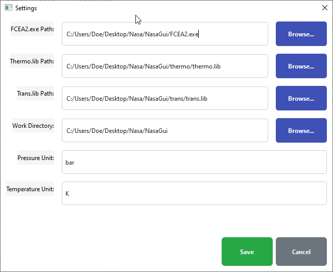

<div align="center">
  
  
  <br><br>
  


  <br><br>

  <h1>⚗️ Chemical Equilibrium Calculator</h1>
  <h3>Professional Thermodynamic Analysis Software</h3>
  <p><strong>PyPI Package:</strong> <a href="https://pypi.org/project/chem-eq-calculator/">chem-eq-calculator</a></p>

</div>

---

## 🚀 Quick Install

```bash
pip install chem-eq-calculator
```

---

## 📸 Screenshots

<details open>
<summary><b>📱 Click to expand/collapse screenshots</b></summary>
<br>

### Main Application Interface

<div align="center">
  
  <p><em>Main application window showing the formulation panel, session management, and results display</em></p>
</div>

<details>
<summary><b>➕ Add Reactant Dialog</b></summary>
<br>
<div align="center">
  
</div>
</details>

<details>
<summary><b>🚀 Nozzle Designer</b></summary>
<br>
<div align="center">
  
</div>
</details>

<details>
<summary><b>📊 Performance Analysis</b></summary>
<br>
<div align="center">
  
</div>
</details>

<details>
<summary><b>📈 Plots & Visualization</b></summary>
<br>
<div align="center">
  
</div>
</details>

<details>
<summary><b>⚙️ Settings Dialog</b></summary>
<br>
<div align="center">
  
</div>
</details>

</details>

---

## 📋 Table of Contents

- [Overview](#-overview)
- [Features](#-features)
- [Installation](#-installation)
- [Quick Start](#-quick-start)
- [Usage Guide](#-usage-guide)
- [NASA CEA2 Integration](#-nasa-cea2-integration)
- [Configuration](#-configuration)
- [Project Structure](#-project-structure)
- [Requirements](#-requirements)
- [License](#-license)

---

## 🔬 Overview

**Chemical Equilibrium Calculator** is a professional-grade desktop application for thermodynamic equilibrium calculations in chemical systems. Built with a modular MVC architecture, it provides precise equilibrium composition analysis, thermodynamic property calculations, and comprehensive performance evaluation.

The software integrates with **NASA's CEA2** for high-precision calculations while maintaining a robust fallback ideal gas calculator.

📦 **PyPI:** [https://pypi.org/project/chem-eq-calculator/](https://pypi.org/project/chem-eq-calculator/)

---

## ✨ Features

### Core Capabilities

| Feature | Description |
|---------|-------------|
| **⚗️ Equilibrium Calculations** | Complex multi-species chemical equilibrium analysis |
| **📊 Thermodynamic Properties** | Temperature, pressure, enthalpy, entropy computations |
| **🚀 Nozzle Design** | Isentropic flow analysis and geometric optimization |
| **🔄 Batch Processing** | Parametric sweeps and sensitivity analysis |
| **📈 Visualization** | Interactive plots, radar charts, and performance graphs |

### User Interface

| Feature | Description |
|---------|-------------|
| **🔍 Searchable Species Database** | 129 oxidizers + 397 fuels with auto-completion |
| **✓ Real-time Validation** | Pre-flight checks before calculation |
| **📁 Export Capabilities** | CSV and Excel export with formatted results |
| **🌐 Multi-language** | English and French interfaces |

### Analysis Tools (25+)

| Category | Tools |
|----------|-------|
| **🔧 Nozzle & Geometry** | Nozzle Designer, Chamber Sizer, Contraction Ratio |
| **🔥 Thermal & Cooling** | Heat Transfer, Regenerative Cooling, Instability Predictor |
| **🌍 Mission & Performance** | Delta-V Calculator, Orbit Insertion, Staging Optimiser |
| **📊 Advanced Analysis** | Sensitivity Analysis, DOE, Composition Tracking |
| **📝 Export & Scripting** | LaTeX Generator, Python Script, Unit Converter |

---

## 🚀 Installation

### From PyPI (Recommended)

```bash
pip install chem-eq-calculator
```

### From Source

```bash
git clone https://github.com/khadev/Chemical-Equilibrium-Calculator.git
cd Chemical-Equilibrium-Calculator
pip install -r requirements.txt
python main.py
```

---

## 🎯 Quick Start

### Basic Calculation Workflow

```bash
# Run the application
chem-eq-calculator
```

```
1. Select Oxidizer    →  Choose from dropdown (e.g., NH₄ClO₄)
2. Select Fuel       →  Choose from dropdown (e.g., HTPB)
3. Set Conditions    →  Adjust Pc, O/F ratio, Ae/At
4. Run Calculation   →  Click "Calculate" or press Ctrl+R
5. Analyze Results   →  Review performance metrics and plots
```

### Example Formulation

| Parameter | Value |
|-----------|-------|
| **Oxidizer** | NH₄ClO₄(I) |
| **Oxidizer Temp** | 298.0 K |
| **Oxidizer Wt** | 72.0 % |
| **Fuel** | HTPB |
| **Fuel Temp** | 298.0 K |
| **Fuel Wt** | 18.0 % |
| **Chamber Pressure** | 50.0 bar |
| **O/F Ratio** | 2.5 |
| **Area Ratio** | 10.0 |

### Expected Results

| Metric | Value |
|--------|-------|
| Specific Impulse (Isp) | ~250 s (2450 m/s) |
| Characteristic Velocity (C*) | ~1580 m/s |
| Thrust Coefficient (Cf) | 1.55-1.65 |
| Chamber Temperature (Tc) | ~3300 K |

---

## 🛰️ NASA CEA2 Integration

This application integrates with **NASA's Chemical Equilibrium with Applications (CEA2)** software for high-precision calculations.

### About NASA CEA2

> CEA computes the equilibrium composition of mixtures via free-energy minimization, and uses the resulting product concentrations to determine thermodynamic and transport properties.

**Source Code:** [github.com/nasa/cea](https://github.com/nasa/cea)  
**Documentation:** [nasa.github.io/cea](https://nasa.github.io/cea/)

### Installation (Optional)

```bash
pip install cea
```

### Configuration

1. Open **Settings** (`Ctrl+,`)
2. Set paths to:
   - `FCEA2.exe` (or `cea` executable)
   - `thermo.lib`
   - `trans.lib`
3. Click **Save**

---

## ⚙️ Configuration

### Unit Preferences

| Unit Type | Options |
|-----------|---------|
| **Pressure** | bar, psi, MPa |
| **Temperature** | K, °C |

### Language Selection

- English (`Settings → English`)
- Français (`Settings → Français`)

### Keyboard Shortcuts

| Action | Shortcut |
|--------|----------|
| Calculate | `Ctrl+R` |
| Validate | `Ctrl+Shift+V` |
| Add Session | `Ctrl+T` |
| Load .inp | `Ctrl+O` |
| Save .inp | `Ctrl+S` |
| Export CSV | `Ctrl+E` |
| Open Settings | `Ctrl+,` |

---

## 📁 Project Structure

```
Chemical-Equilibrium-Calculator/
├── chem_eq_calculator/          # Main package
│   ├── __init__.py
│   ├── main.py
│   ├── engine/                  # Calculation logic
│   ├── models/                  # Data layer
│   ├── ui/                      # User interface
│   │   ├── widgets/
│   │   └── dialogs/
│   ├── config/                  # Configuration files
│   └── database/                # Species database
├── Screenshots/                 # Application screenshots
├── setup.py                     # PyPI configuration
├── README.md
├── LICENSE
└── requirements.txt
```

---

## 📦 Requirements

```txt
PySide6>=6.6.0      # Qt6 Python bindings
matplotlib>=3.7.0   # Plotting library
numpy>=1.24.0       # Numerical operations
pandas>=2.0.0       # Data export
qtawesome>=1.3.0    # Icons
```

---

## 🐛 Troubleshooting

| Issue | Solution |
|-------|----------|
| **ModuleNotFoundError** | Run `pip install chem-eq-calculator --force-reinstall` |
| **No species in dropdown** | Verify `databasecea.txt` exists in `database/` folder |
| **Plots not displaying** | `pip install matplotlib` |
| **FCEA2 execution error** | Configure CEA2 paths in Settings |

---

## 📄 License

```
Chemical Equilibrium Calculator
Copyright (C) 2026 Oukil Khaled Ibn Elwalid

This program is free software: you can redistribute it and/or modify
it under the terms of the GNU General Public License as published by
the Free Software Foundation, either version 3 of the License, or
(at your option) any later version.

This program is distributed in the hope that it will be useful,
but WITHOUT ANY WARRANTY; without even the implied warranty of
MERCHANTABILITY or FITNESS FOR A PARTICULAR PURPOSE. See the
GNU General Public License for more details.
```

---

## 👨‍💻 Author

**Oukil Khaled Ibn Elwalid**

- GitHub: [@khadev](https://github.com/khadev)
- PyPI: [chem-eq-calculator](https://pypi.org/project/chem-eq-calculator/)

---

<div align="center">

**⚗️ Made for the scientific community**

[](https://pypi.org/project/chem-eq-calculator/)
[](https://github.com/khadev/Chemical-Equilibrium-Calculator)

</div>

